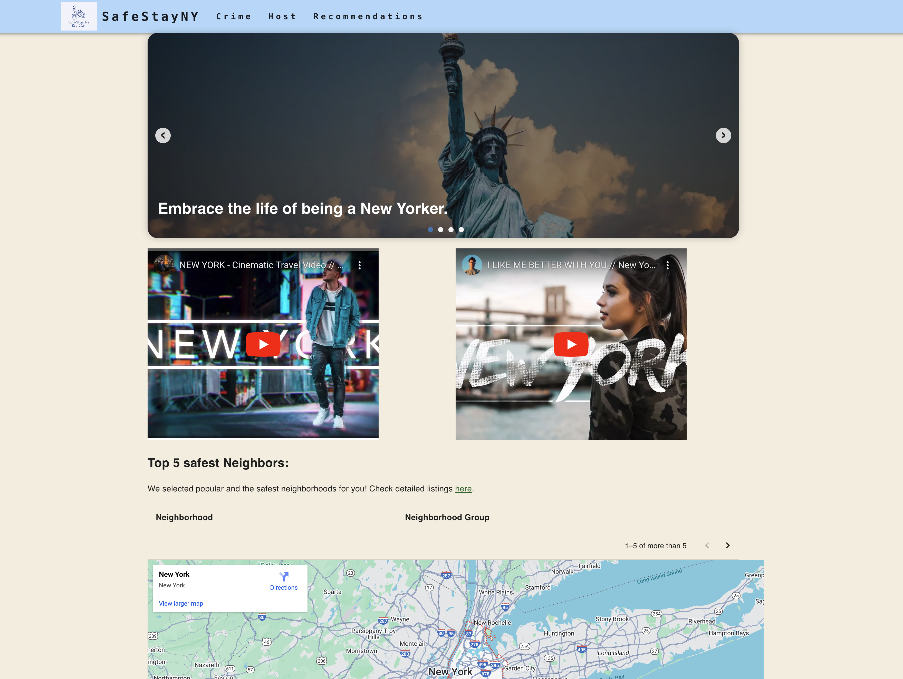
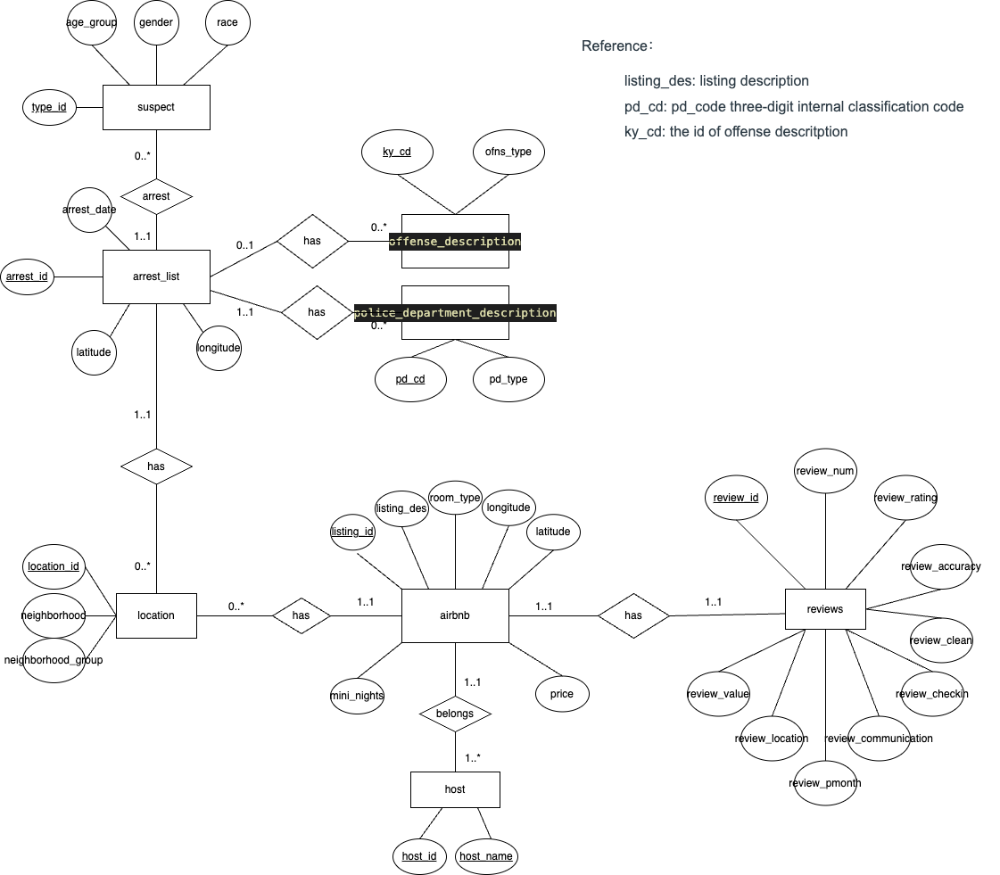

# SafeStayNY Search Platform

### Live Website:

<!-- ### Cover Image:
 -->

### Live Video:

Welcome to SafeStayNY, your go-to platform for insights and recommendations on safety statistics, personalized host discovery, and Airbnb listings with safety scores in New York City. 🏙️🔍

While traditional platforms like Airbnb focus on price and availability, many users want more—like knowing which neighborhoods are safe 🛡️ and which hosts are trustworthy 🏠 for a better rental experience.

Our platform meets these needs by analyzing recent crime data 📊 to evaluate neighborhood safety across NYC. We also highlight top hosts based on user preferences 🌟 and generate tailored Airbnb listings that prioritize safety and your other specific criteria. 🗺️🔑

---

## 🎬 Key Features:

- **Crime Information:** View statistical data on top crime types and demographics, with filters to refine results for specific areas or the entire New York City region.📊🔍
- **Host Search:** Search or filter for trusted Airbnb hosts based on preferred neighborhoods, superhost status, and user-valued factors. Explore intuitive bar visuals and convenient links for further details.🏠🌟
- **Airbnb Recommendations:** Get recommendations for safe accommodations in New York through various filters, including five featured listings with the lowest crime rates and prices in each Neighborhood Group.🏙️🔑

## 🛠️ Project Architecture

### Backend
- **MySQL:** Relational database management system for storing and managing data.
- **Node.js:** Server-side runtime for handling API requests and interacting with the database.
- **Express:** Web application framework for Node.js, used to build and manage API endpoints.

### Frontend
- **React:** JavaScript library for creating dynamic user interfaces.
- **Material-UI:** Collection of React components for streamlined and efficient web development.

## 📊 Database Design

The database design of SafeStayNY is meticulously crafted to manage over 2 million NYPD arrest records and nearly 40,000 NYC Airbnb listings, ensuring efficient data retrieval and robust management. Below is an overview of the key tables and their relationships, illustrated by an ER diagram:

### ER Diagram

The database is designed to be in Third Normal Form (3NF) and Boyce-Codd Normal Form (BCNF) to minimize redundancy and enhance data integrity. Here's an overview of the structure:

- **airbnb:** Contains details about Airbnb listings, including attributes like `listing_id`, `listing_des`, `listing_url`, `room_type`, `price`, `longtitute`, and `latitude`.
- **host:** Stores host information linked to Airbnb listings.
- **reviews:** Stores reviews related to Airbnb listings.
- **arrest_list:** Holds New York arrest records, including attributes like `arrest_id`, `arrest_date`, `longtitute`, and `latitude`.
- **suspect:** Stores suspect data tied to arrest records.
- **location:** Contains location data, including attributes like `location_id`, `neighborhood`, and `neighborhood_group`.

To further normalize the original data tables and achieve BCNF, we decompose tables to eliminate any remaining functional dependencies. For example, we split a table that stores both `airbnb` and `host` information into two separate tables. This process helps ensure that each table contains data related to a single topic and reduces redundancy.

### Benefits of BCNF:

- **Eliminates Redundancy:** Reducing redundancy minimizes storage costs and prevents data anomalies.
- **Improves Data Integrity:** Organizing data into well-structured tables ensures consistency and accuracy.
- **Enhances Query Performance:** Optimized tables lead to more efficient queries, improving overall database performance.

By adhering to these normalization principles, SafeStayNY maintains a robust and efficient database structure that minimizes redundancy and ensures data integrity.

## 🚀 Optimization Strategies

Given the large dataset with millions of entries, initial loading times were quite long. To enhance performance and reduce loading times, we implemented several optimization strategies:

1. **Caching:** To address the performance challenges associated with joining large tables, we implemented caching by creating intermediate tables, as MySQL does not support materialized views. Specifically, we introduced the `crime_count` table, which stores `location_id`, `neighborhood`, `neighborhood_group`, and pre-calculated `count` values using the SUM() function. With only 306 tuples, this table is approximately 1000 times smaller than the original join output, allowing for efficient joins with other tables. This optimization significantly reduced the time spent on multiple joins, boosting data retrieval speed and improving overall application performance.

2. **Indexes:** We created indexes on columns frequently used in `WHERE` and `ORDER BY` clauses to enhance query performance. Given that major queries often involve the `neighborhood` and `neighborhood_group` attributes, we introduced a compound index with `neighborhood_group` as the prefix. This indexing strategy optimizes performance for queries that may or may not specify the `neighborhood`, resulting in significant improvements in search and sorting efficiency.

These strategies boosted performance and reduced load time by over 80%, cutting some page load times from over 15 seconds to under 5 seconds.

## 📘 References and Credits

- **Inside Airbnb: Get the Data:** [Airbnb Datasets](https://insideairbnb.com/get-the-data/)
- **NYPD Arrest Data (Year to Date) Catalog:** [NYPD Arrest Datasets](https://catalog.data.gov/dataset/nypd-arrest-data-year-to-date)
- **React:** [React Documentation](https://reactjs.org/)
- **Node.js:** [Node.js Documentation](https://nodejs.org/en/)
- **MySQL:** [MySQL Documentation](https://dev.mysql.com/doc/)

## ✨ Contributors

- 👩‍💻 **Boer Liu:** [@boer-coding](https://github.com/boer-coding)
- 👩‍💻 **Hannah Luan** [@hqluan](https://github.com/hqluan)
- 👩‍💻 **Ying Zhang**  [@athrala](https://github.com/athrala)
- 👨‍💻 **Ford Guo** [@codingnoobyford](https://github.com/codingnoobyford)

## Dependencies:

`npm install` 
`npm install recharts` 
`npm install @mui/icons-material`

## Instruction to build: 

In the project directory, you can run: 
`npm start` 
Runs the app in the development mode.  
Open [http://localhost:3000](http://localhost:3000) to view it in your browser. 

---
Start exploring SafeStayNY today and discover the safest areas in New York for your stay! 🏙️✨
